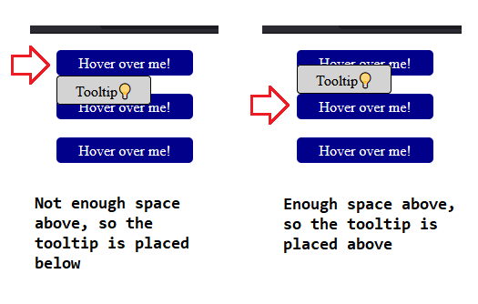

# useLayoutEffect Example by Emre Bener

This minimal React project illustrates an example use case for the useLayoutEffect hook.

## Installation

- **git clone REPO_URL**
- **cd uselayouteffect-example**
- **npm i** (installs dependencies)
- **npm run dev** (starts local development server)

## Useful Links

- You can find the full blog post at: https://medium.com/@emrebener/when-to-use-uselayouteffect-over-useeffect-in-react-e68bd2653282
- Follow me on LinkedIn: https://www.linkedin.com/in/emrebener/

## Screenshot

